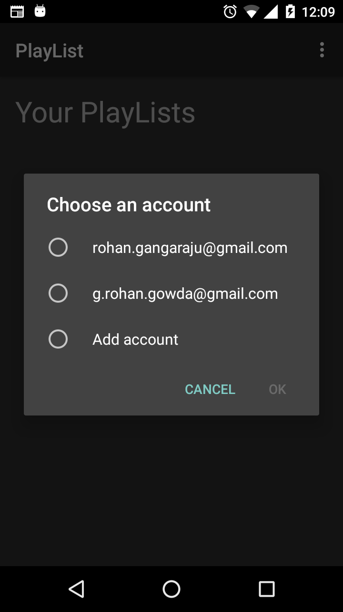
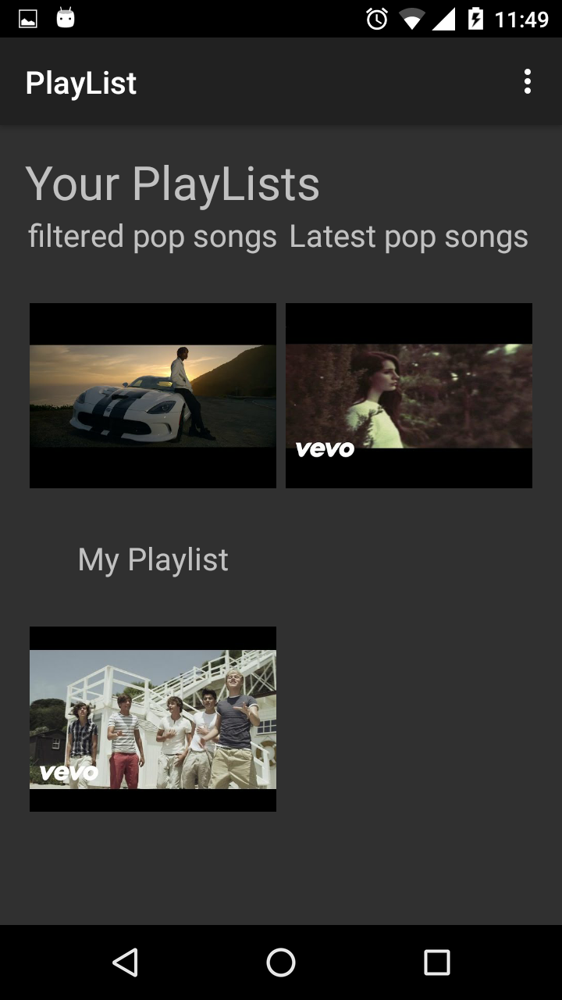
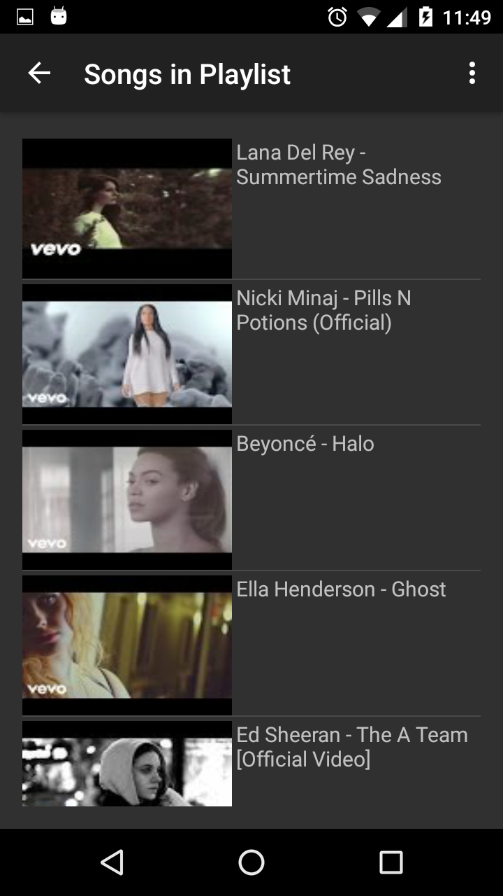

# YouTubeListener

This app lets you find audio files of the songs in your YouTube playlist and plays them. 

Main reasons for the app :

1) Lesser bandwidth consumption since only the audio file is played unlike the YouTube app which also plays the video.

2) Uninterrupted songs. The YouTube app stops playing songs when your phone screen locks or you switch apps. This app on the other hand lets you play the songs even if your screen locks.

### Screenshot - Select your Google account

### Screenshot - List of your youtube playlists

### Screenshot - List of songs in your playlist

